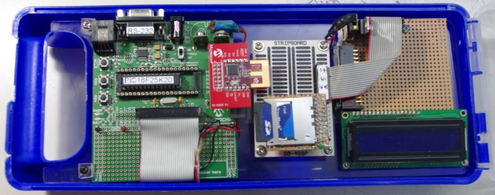

# Conversor Análogo/Digital

## Usando el compilador de lenguaje C: MPLAB XC8

Esta propuesta pretende un conversor A/D multifunciona: Se diseña y experimenta en base al kit de demostración PICDEM Z de la compañía [Microchip](https://www.microchip.com/), el cual permite desarrollar y evaluar soluciones inalámbricas ZigBee™ y MiWi™. Una extensión a la hardware solventa la carencia de una salida LCD y otros requerimientos; se ha diseñado y construido sobre tarjeta tipo STRIPBOARD SB-468P: Implementa Amplificador y Filtro para conectar un sensor (por ejemplo un geófono). Teniendo como base una tarjeta de voltajes de referencia, reloj de tiempo real, GPS, tarjetas SD, etc.

El sistema consiste, de un PIC18F25K20 que digitaliza la señal de salida de un preamplificador de una sola etapa con poco ruido y bajo desplazamiento; previo acondicionamiento y filtrado de la señal analógica por un filtro de celdas tipo Sallen Key -un filtro pasa bajo y un pasa altos-. El sistema de amplificación, consiste de un ampificador operacional configurado en modo diferencial y un regulador de la fuente de alimentación que genera también la tensión negativa; a partir de una fuente no regulada de 12 V. La ganancia de tensión es Av = 33.2 (R5 / R1 = R4 / R2). La resistencia de entrada es Ri = 20kohms, que en paralelo con Rd es la resistencia de amortiguación externa Rp (Rp = Ri * Rd / (Ri + Rd). Por lo tanto, para un geófono de la constante G del generador y la resistencia Rg de la bobina, el factor de aumento total, incluido el amplificador, será G · Av · Rp / (Rp + Rg). El amplificador está balanceada, de modo que se puede conectarle un cable de par trenzado largo. Este circuito fue construido de acuerdo a las recomendaciones de  de Jens Havskov, Gerardo Alguacil (2006) [Earthquake Seismology (Modern Approaches In Geophysics)](https://doi.org/10.1007/978-3-319-21314-9).

<table class="default">
  <tr>
     <td></td>
     <td></td>
    <td></td>
     <td></td>
    <td></td>
    <td></td>
    <td></td>
  </tr>
</table>

El entorno de programación y desarrollo utilizado fue el [MPLAB®](https://www.microchip.com/en-us/development-tools-tools-and-software/mplab-x-ide) entorno X de desarrollo integrado (IDE) de Microchip y el compilador de lenguaje C [MPLAB XC8](https://www.microchip.com/en-us/development-tools-tools-and-software/mplab-xc-compilers). También se utilizó MPLAB® [Code Configurator (MCC)](https://www.microchip.com/mplab/mplab-code-configurator); un entorno de programación grafico (libre), que genera código C mediante una interfaz intuitiva, que habilita y configura un amplio conjunto de periféricos y funciones.

Para el diseño electrónico y la simulación del filtro y amplificador, se utilizó Proteus Design Suite®; un software de automatización de diseño electrónico, desarrollado por [Labcenter Electronics Ltd.](https://www.labcenter.com/).

**Como ejemplo de utilización del conversor A/D:** se desarrolló un sistema de digitalización, almacenamiento y visualización para los datos proveniente de un sensor (sismómetro tipo SM-6). Desde la tarjeta de desarrollo (PICDEM Z) se envía la data digitalizada por puerto serial a una aplicación en una computadora tipo PC (o laptop) codificada en lenguaje [Processing](https://processing.org/), que se llamó ["visor-geofono"](https://github.com/rommeljose/visor-geofono) y ["visor sismómetro"](https://doi.org/10.7910/DVN/1JXSYT).
